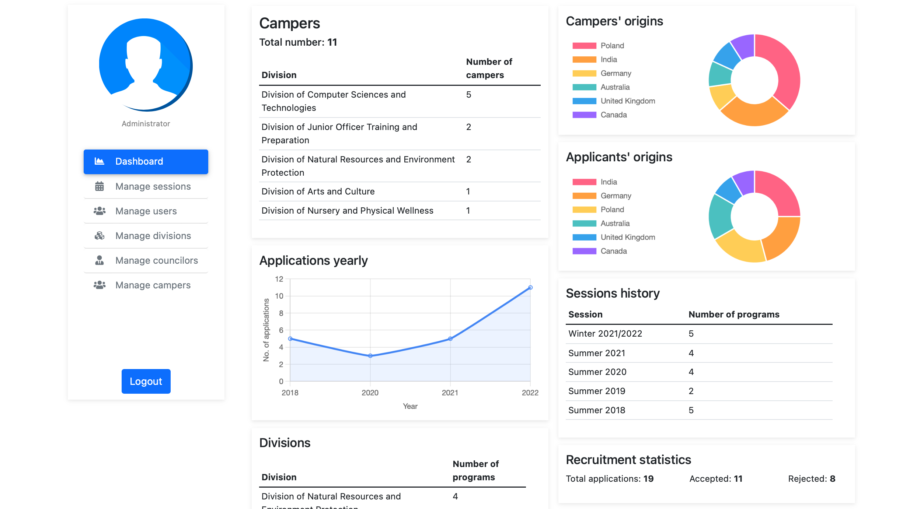
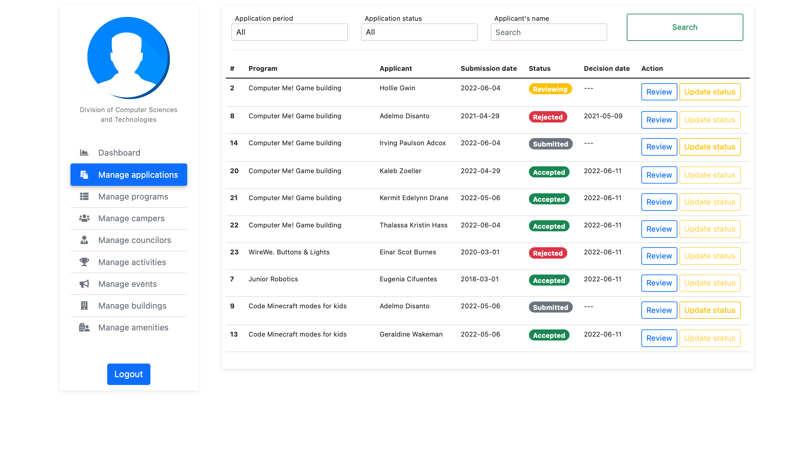
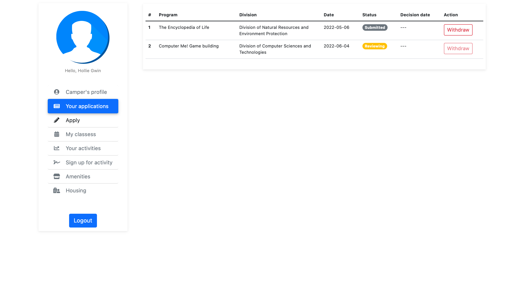
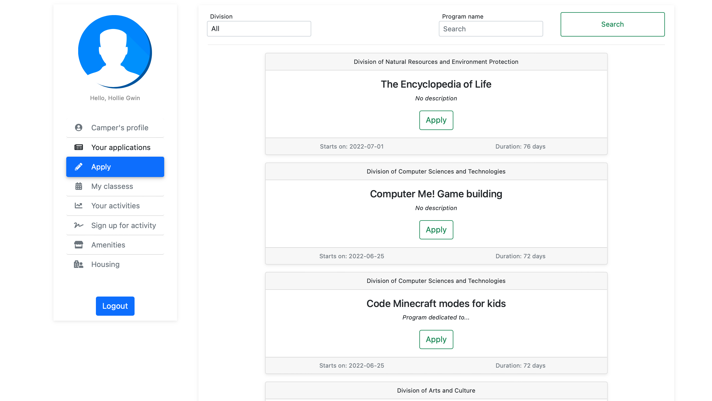

<!-- ABOUT THE PROJECT -->
## About The Project 
The objective of this **Summer Camp Management System** is to improve the modern-day summer camp enrollment procedure as well as to provide the parties with a more organized and convenient way of interacting with and managing a summer camp by introducing a web-based management solution. 

The primary goal of the project is to deliver a database-driven website for the local summer camp, which can be used by every party that impacts the work and is involved in the main ideas of summer camps. The system will provide anyone interested with the opportunity to submit a summer camp application - in an easy and convenient way - as well as to enhance their summer camp experience. Also, the system will introduce the workers to a well-organized and efficient way of managing the summer camp.

### Selected views

- #### Administrative panel - Dashboard
  > The dashboard view focuses primarily on the business objectives of the summer camp. Being one of the most important views and reasons why the system was developed, it provides the comprehensive overview of the institution's structure as well as gives important business insights. 
  

- #### Division panel - Manage applications
  > The applications management view is responsible for performing the recruitment procedure. It is equipped with all the necessary tools to assist recruiters as well as quickly and accurately parse applications by keywords to sift out the top candidates.  

- #### Camper panel - Your applications
  > The submitted applications view is used by the campers (clients) to track their submitted applictions. 

- #### Camper panel - Apply
  > The applications submission view is used by the campers (clients) to send their application for the desired program in the easiest and most efficient way. The view is equipped with all the neccesary tools to create a positive user experience and provide clear and an easy application procedure.

**NOTE:** *All data presented in the views above are hypothetical data and used for presentation purposes only.*

(<a href="#top">back to top</a>)

### Built With

* [Python](https://www.python.org)
* [Flask](https://flask.palletsprojects.com/en/2.0.x/)
* [HTML](https://html.com)
* [CSS](https://developer.mozilla.org/en-US/docs/Web/CSS)
* [JS](https://www.javascript.com)
* [JQuery](https://jquery.com)
* [Bootstrap](https://getbootstrap.com)
* [MySQL](https://www.mysql.com)

(<a href="#top">back to top</a>)

<!-- LICENSE -->
## License

Distributed under the MIT License. See `LICENSE.txt` for more information.

(<a href="#top">back to top</a>)

<!-- Documentation -->
## Documentation

Documentation available upon request.

(<a href="#top">back to top</a>)

